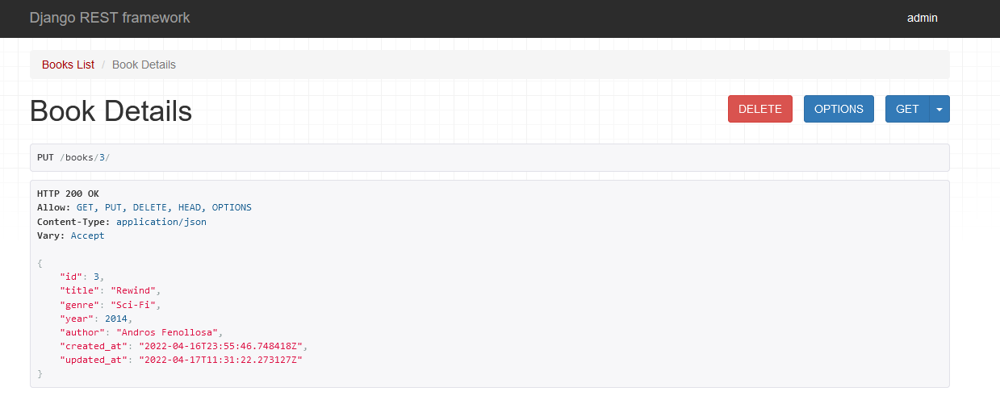

### Update

Now it's time to _update_ the book.
Add the related [test](tests/books/test_views.py).

1. update is performed as expected (the data could be updated partially):
  
```python
...
    new_book_details = {
            "title": "Rewind",
            "genre": "Sci-Fi",
            "author": "Andros Fenollosa",
            "year": "2014",
        }
...
@pytest.mark.django_db
def test_update_book(client): # new

    # Given
    book = Books.objects.create(
        title=book_detail["title"],
        genre=book_detail["genre"],
        author=book_detail["author"],
        year=book_detail["year"],
    )

    # When
    response = client.put(
        f"/books/{book.id}/",
        new_book_details,
        content_type="application/json"
    )

    # Then
    assert response.status_code == 200
    assert response.data["title"] == new_book_details["title"]
    assert response.data["genre"] == new_book_details["genre"]
    assert response.data["author"] == new_book_details["author"]
    assert response.data["year"] == new_book_details["year"]

    response_detail = client.get(f"/books/{book.id}/")
    assert response_detail.status_code == 200
    assert response_detail.data["title"] == new_book_details["title"]
    assert response_detail.data["genre"] == new_book_details["genre"]
    assert response_detail.data["author"] == new_book_details["author"]
    assert response_detail.data["year"] == new_book_details["year"]

```

2. fail if update the book which does not exist:

```python
@pytest.mark.django_db
def test_update_invalid_book_id(client): # new
    response = client.put(
        f"/books/11/",
        new_book_details,
        content_type="application/json"
    )
    assert response.status_code == 404
```

3. fail if update the book with wrong JSON:

```python
@pytest.mark.django_db
def test_update_invalid_book_json(client): # new
    # Given
    book = Books.objects.create(
        title=book_detail["title"],
        genre=book_detail["genre"],
        author=book_detail["author"],
        year=book_detail["year"],
    )

    # When
    resp = client.put(
        f"/books/{book.id}/",
        {
            "country": "Italy",
        },
        content_type="application/json"
    )

    # Then
    assert resp.status_code == 400
```

The [view](books/views.py) will be simple thanks to already created Serializer and BookDetails.

```python
# books/views.py

from django.http import JsonResponse
from rest_framework.views import APIView
from rest_framework.response import Response
from rest_framework import status
from .serializers import LibroSerializer
from .models import Libros

def ping(request):
...

class LibrosList(APIView):

...

class LibrosDetails(APIView):

...

    def put(self, request, pk):  # new
        book = Books.objects.filter(pk=pk).first()
        serializer = BookSerializer(book, data=request.data)
        if book and serializer.is_valid():
            serializer.save()
            return Response(serializer.data, status=status.HTTP_200_OK)
        return Response(serializer.errors, status=status.HTTP_400_BAD_REQUEST)

...

```

Get up and try again to check the views with new changes:


