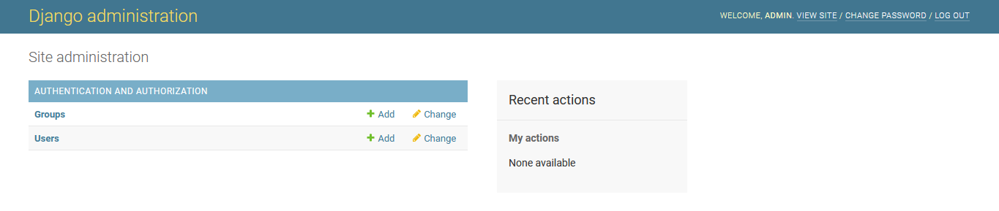

### Create the project

Let's create the virtual environment and activate it

```commandline
python3 -m venv venv
source venv/bin/activate
```

Now we create the file with txt extension and call it requirements.txt
This will be the place where we identify the dependencies (libraries) for installation.

```commandline
django
djangorestframework
# Instrument for testing
pytest
# Integration with Django
pytest-django
# Generator of the test data
Faker
```

Let's install the dependencies.

```commandline
pip3 install -r requirements.txt
```

Now we are creating our project with the name _proyecto_.

```commandline
django-admin startproject proyecto .
```

Inside the project we may have a lot of applications. At the moment create _books_.

```commandline
python manage.py startapp books
```
Add _books_ into the configuration INSTALLED_APPS in a file _proyecto/settings.py_:

```python
# proyecto/settings.py

INSTALLED_APPS = [
    'django.contrib.admin',
    'django.contrib.auth',
    'django.contrib.contenttypes',
    'django.contrib.sessions',
    'django.contrib.messages',
    'django.contrib.staticfiles',
    'rest_framework', #new
    'books', #new
]
```

Let's apply the migration for DB.

```commandline
python manage.py makemigrations
python manage.py migrate
```

It will be created DB SQLite file in the main directory.
You may learn a lot of things of DB with a help of the course https://programadorwebvalencia.com/cursos/sql/ <br>

Let's create super user for control admin panel.

```commandline
python manage.py createsuperuser
```

Run the server.

```commandline
python manage.py runserver
```

Open the browser with the link that you've got in terminal:

```commandline
...
Starting development server at http://127.0.0.1:8000/
Quit the server with CTRL-BREAK.
```

It shows the welcome screen indicating that everything works as expected and Django
is ready to work with it.


If you want access to the admin panel with superuser credentials you just need to follow
http://127.0.0.1:8000/admin/.


