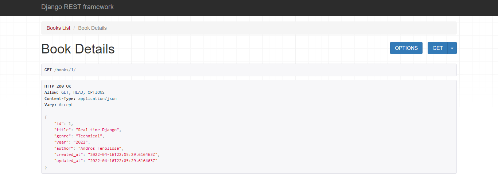
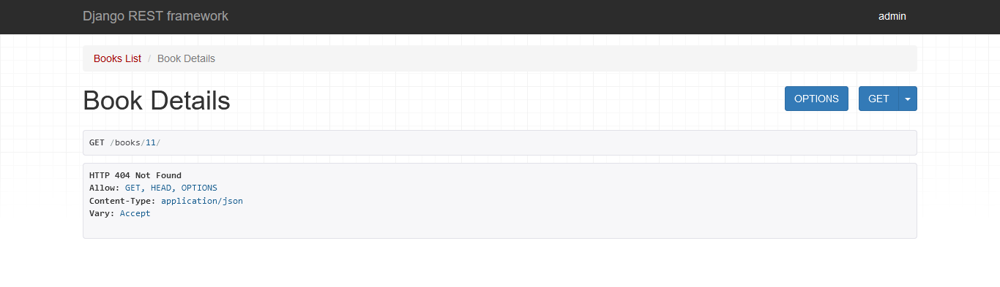

### Details

Now we are going to take of representation and view the concrete book details.
Let's create the test which we could invoke to check if the details of the concrete book was returned and
if there is no such book - the error will be returned.
Let's add to [test_views](tests/books/test_views.py) both tests.


```python
# tests/books/test_views.py

import pytest
from books.models import Books

book_detail = {
        "title": "Real-time-Django",
        "genre": "Technical",
        "author": "Andros Fenollosa",
        "year": 2022,
}

...

@pytest.mark.django_db
def test_get_single_book(client): # new

    # Given
    book = Books.objects.create(
        title=book_detail["title"],
        genre=book_detail["genre"],
        author=book_detail["author"],
        year=book_detail["year"],
    )

    # When
    resp = client.get(f"/books/{book.id}/")
    
    # Then
    assert resp.status_code == 200
    assert resp.data["title"] == book_detail["title"]

@pytest.mark.django_db
def test_get_invalid_single_book_id(client): # new

    # When
    resp = client.get(f"/books/-1/")

    # Then
    assert resp.status_code == 404
```

It's time to define the [view](books/views.py):

```python
...
class BookDetails(APIView): # new

    def get(self, request, pk):
        book = Books.objects.filter(pk=pk).first()
        if book:
            serializer = BookSerializer(book)
            return Response(serializer.data, status=status.HTTP_200_OK)
        return Response(status=status.HTTP_404_NOT_FOUND)
```

And register the [url](books/urls.py).
Define that we will need the number(id) of the book. For example, _books/11/_. 

```python
from django.urls import path
from books.views import ping, BooksList, BookDetails

urlpatterns = [
    path("ping/", ping, name="ping"),
    path("books/", BooksList.as_view()),
    path("books/<int:pk>/", BookDetails.as_view()), # new
]
```

The test will pass. 
You also could test with HTTP client what was received.
(Do not forget to run the server and create the book).




