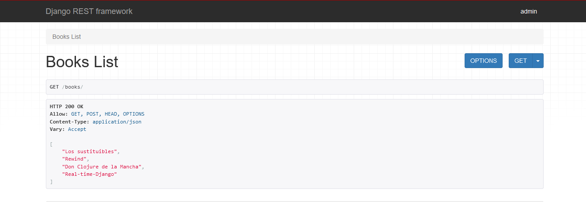

### List

Of course, we will need to loop all the books.
Perform GET request where we will loop all the elements.
And, as usual, let's create the test first.

```python
# tests/books/test_views.py

import pytest
from django.urls import reverse

from books.models import Books

...

@pytest.mark.django_db # new
def test_get_all_books(client, faker): # <- please, a minute of your attention, here is used 'faker'

    # Given
    def create_random_book():
        return Books.objects.create(
            title=faker.name(),
            genre=faker.name_nonbinary(),
            author=faker.name_nonbinary(),
            year=faker.year(),
        )

    book_first = create_random_book()
    book_second = create_random_book()

    # When
    response = client.get("/books/")

    # Then
    assert response.status_code == 200
    assert response.data[0] == book_first.title
    assert response.data[1] == book_second.title
```
Now, let's create a list in [views](books/views.py):

```python
class BooksList(APIView):

    def get(self, request):
        books = [book.title for book in Books.objects.all()]
        return Response(books)
```

No need to register the new route - it will be used the same route as for a _post_.
Run the test - the test is passed:

